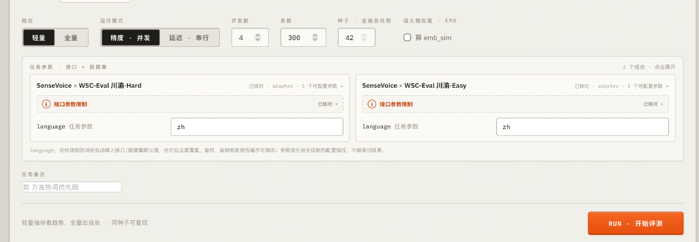
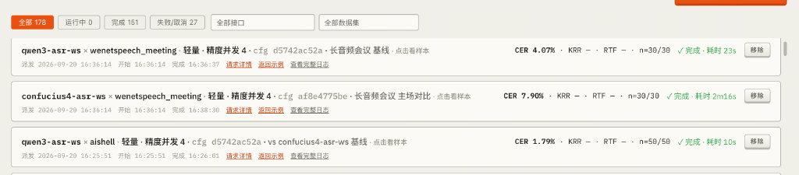
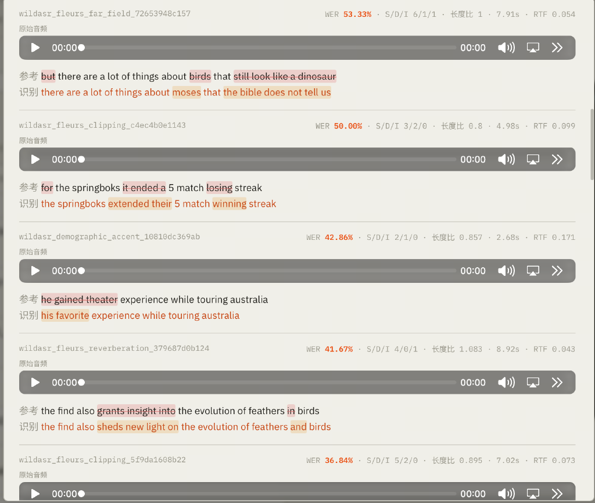
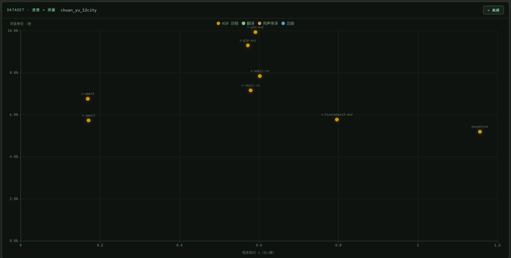

# asr-eval

语音模型测评框架与看板。底层按四种 `task`（`asr` / `translate` / `summarize` / `diarization`）路由，
看板提供 ASR、翻译、同传、总结、其他五类入口。

本仓库只包含**框架、数据集构建脚本和看板**：

- 不包含任何数据集本体、测评结果或榜单数字。
- 不内置任何服务地址或密钥。所有端点默认为空，通过环境变量配置（见 `.env.example`）。
- 数据集从公开来源下载（`datasets/download.sh`），各数据集许可见 `datasets/README.md`。
  部分数据集为非商用或需要注册授权，使用前请自行确认许可。

| 场景 | 输入 | 指标 |
|---|---|---|
| ASR 识别 | 音频（可带热词） | CER(中) / WER(英) + KRR + 95% CI；延迟 / RTF |
| 翻译 | 文本，或音频（直翻 / ASR→MT 级联） | chrF / BLEU + CI（可选 COMET） |
| 同传 | 语音流按 1× 实时节奏发送 | chrF / BLEU、AL / LAAL / TTFB、tts_err |
| 总结 | 文本，或会议音频 | 字级 ROUGE-L / ROUGE-1 |
| 其他 | 说话人分离 / 会议纪要 / TTS 公式转写 | DER / ROUGE / CER |

## 架构

四步单向流水线，步骤间用文件解耦，任何一步都可以单独重跑：

```
 数据集            build_manifest        infer (+adapters)        score              dashboard
 parquet/tar/  ──▶ manifests/*.jsonl ──▶ infer/*.jsonl     ──▶  results/*.json  ──▶  看板
 Lhotse/wav        {id,audio_path,        {id,hyp,                {summary,
                    ref_text,task…}        elapsed_s,ok}           samples,meta}
```

- **manifest** 统一各数据集的封装；**adapter** 统一各模型的协议。加数据集和加模型互不影响。
- **infer 与 score 分离**：模型只调用一次。改指标或规一化口径只需重跑 score。
- `task` 字段决定走哪条路径：

| task | infer 调用 | score 计算 |
|---|---|---|
| `asr`（默认） | `adapter.transcribe(audio)` | CER / WER + KRR + emb_sim |
| `translate` | `adapter.generate(item)` | chrF + BLEU + emb_sim |
| `summarize` | `adapter.generate(item)` | ROUGE-L / ROUGE-1 |
| `diarization` | `adapter.transcribe(整段)` | DER（pyannote） |

```
eval/          跑分框架：build_manifest / adapters / infer / score / runner / metrics / normalize …
dashboard/     看板：server.py（FastAPI + 任务队列）+ 静态页面
datasets/      download.sh、数据集清单与许可（数据本体不入仓）
scripts/       通用工具脚本
deploy/        可选的 GPU 打分服务（XCOMET / UTMOS / WeSpeaker / Whisper）
tests/         单元测试与指标黄金用例
```

## 快速开始

### 0) 先看输出长什么样（无需模型和数据）

```bash
uv sync --locked
uv run python eval/score.py \
  --manifest examples/mini/manifest.jsonl \
  --infer examples/mini/infer_demo.jsonl --out /tmp/asr-eval-mini.json
```

用预置的识别结果演示 score 阶段，见 `examples/mini/README.md`。

### 1) 准备数据

数据本体不入仓。先下载核心公开集（约 5-7 GB，无需登录；依赖 `hf`、`git`、`git-lfs`、`curl`）：

```bash
bash datasets/download.sh phase_a
```

其他阶段和各数据集的来源、许可见 `datasets/README.md`。

### 2) 配置要测的端点

复制 `.env.example` 为 `.env`，只填你要测的接口（例如 `SENSEVOICE_URL`），或使用厂商预设并设置对应 key。
`.env` 与环境变量均可，环境变量优先。

### 3) 生成 manifest 并跑分

```bash
uv run --with pyarrow python eval/build_manifest.py aishell --shuffle --limit 30 --out manifests/aishell_30.jsonl
uv run python eval/runner.py --manifest manifests/aishell_30.jsonl \
  --model sensevoice --language zh --out results/aishell_sensevoice.json
```

常用选项：

- 中文自动用 CER，英文（`lang=en`）自动用 WER；`err_ci95` 为 95% bootstrap 置信区间。
- `--hotwords` 把 manifest 的 keywords 传给声明了 `supports_hotwords` 的 adapter。
- 断点续跑：崩溃后重跑同一条命令会跳过已完成的样本。`--workers N` 提速（延迟指标会标记为无效）。
- 换指标不重调模型：`python eval/score.py --manifest … --infer infer/<x>.jsonl`。
- 失败或空输出不计入精度；成功率低于 95% 的结果标 `low_coverage`，不参与排名。
- 每次 infer 写入 `__meta__` 行（端点、参数、manifest 指纹、时间），score 会校验指纹是否一致。

## 看板



**运行配置**：选择档位（轻量抽样 / 全量）、运行模式（精度并发 / 延迟串行）、并发数、条数和种子。
每个「接口 × 数据集」组合可单独设置 `language`、热词等任务参数，并显示该接口的参数契约核对状态。
参数变化会生成新的配置指纹，不会续跑旧结果。



**任务列表**：按状态（全部 / 运行中 / 完成 / 失败或取消）、接口、数据集筛选历史任务。
每行显示接口、数据集、运行模式、配置指纹，以及 CER、KRR、RTF、样本数、状态和耗时，
并可查看请求详情、返回示例和完整日志。配置指纹相同的任务会自动去重复用。



**样本级对比**：逐条显示参考与识别文本，删除、替换、插入分别高亮，同时给出单条 WER/CER、
S/D/I 计数、长度比、耗时和 RTF，可直接试听原音频，便于定位错误类型。



**速度 × 质量散点图**：按数据集比较各接口，横轴是单条耗时（越靠左越快），纵轴是错误率（越靠下越准），
点按场景（ASR / 翻译 / 同声传译 / 总结）着色。成功率低于 95% 的结果不参与作图。


**样本浏览**：在跑分前直接看数据集本身，音频与标注并列显示。

```bash
uv sync --locked
uv run python dashboard/server.py        # http://localhost:8088
```

- 必须显式设置 `DASH_PASS`（HTTP Basic 鉴权，账号由 `DASH_USER` 指定，默认 `admin`）。未设置时所有请求返回 503；
  仅在隔离的本机开发环境，可在 `.env` 或环境变量里写 `DASH_PASS=`（空值）来关闭鉴权。对外暴露时必须用强口令。
- 自定义接口保存在 `dashboard/interfaces.json`（已被 `.gitignore` 排除）。密钥只从环境变量读取。
- 同传 `tts_err` 首次运行会下载 faster-whisper 权重到 `HF_HOME`。
- COMET 为可选重型依赖，建议装在独立环境，并用 `COMET_PYTHON` 指向它。
- `/api/doctor` 显示各可选依赖的实际检测结果。

## 内置 adapter

| 类别 | 名称 |
|---|---|
| 自托管平台（需自行配置 `ASR_PLATFORM_URL`） | `light`、`std`、`adv`、`sse`、`adv-domain`、`plat-simult`、`plat-simult-ws`、`plat-realtime`、`plat-minutes`、`plat-formula`、`plat-diar` |
| 开源 / 厂商 ASR | `sensevoice`、`gemma-text`、`cascade-gemma`、`qwen-asr`、`qwen3-asr-ws`、`whisper-local`、`xf-spark-slm-iat` |
| 同传 | `qwen-simult`、`doubao-simult`、`xf-simult` |
| 通用模板 | 看板「添加接口」提供 OpenAI audio / chat、自定义 HTTP 等协议模板，以及 OpenAI、DashScope、MiMo 厂商预设 |

自托管平台类 adapter 对应某个特定的 HTTP/WS 服务协议，只有你自己部署了兼容服务才能使用。
需要接入别的模型时，请参考下面的扩展方式。

## 测试

```bash
make test
# 等价于: uv run --with pytest pytest tests/ -q
```

改 `metrics.py` / `normalize.py` 必须跑全量测试。`tests/` 里是手算验证过的黄金用例。

## 扩展

- **加数据集**：在 `eval/build_manifest.py` 加 builder，再在 `dashboard/server.py` 的 `DATASETS` 注册并标 `runnable: True`。
- **加模型**：在 `eval/adapters.py` 加 adapter（ASR 实现 `transcribe()`，文本任务实现 `generate()`），注册到 `ADAPTERS`。
  支持热词的加类属性 `supports_hotwords = True`。

## 许可

代码以 Apache-2.0 发布，见 `LICENSE`；第三方内容及其许可状态见 `NOTICE`。`deploy/` 下如有第三方组件，遵循其各自的许可。
数据集和第三方模型的许可由其发布方决定，不受本仓库许可覆盖。
